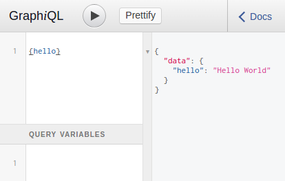

Perl 6 GraphQL
==============

[](https://travis-ci.org/CurtTilmes/Perl6-GraphQL)

A [Perl 6](https://perl6.org/) implementation of the
[GraphQL](http://graphql.org/) standard.  GraphQL is a query language
for APIs originally created by Facebook.

## Intro

Before we get into all the details, here's the Perl 6 GraphQL "Hello World"
[hello.pl](https://github.com/CurtTilmes/Perl6-GraphQL/blob/master/eg/hello.pl)


```
use GraphQL;
use GraphQL::Server;

class Query
{
    method hello(--> Str) { 'Hello World' }
}

my $schema = GraphQL::Schema.new(Query);

GraphQL-Server($schema);

```

You can run this with a GraphQL query on the command line:
```
$ perl6 hello.pl --help
Usage:
  hello.pl <query> 
  hello.pl [--filename=<Str>] 
  hello.pl [--port=<Int>] 

$ perl6 hello.pl '{hello}'
{
  "data": {
    "hello": "Hello World"
  }
}
```

You can even ask for information about the schema and types:
```
$ perl6 hello.pl '{ __schema { queryType { name } } }'
{
  "data": {
    "__schema": {
      "queryType": {
        "name": "Query"
      }
    }
  }
}

$ perl6 hello.pl '{ __type(name: "Query") { fields { name type { name }}}}'
{
  "data": {
    "__type": {
      "fields": [
        {
          "name": "hello",
          "type": {
            "name": "String"
          }
        }
      ]
    }
  }
}
```

That's fine for the command line, but you can also easily wrap GraphQL
into a web server to expose that API to external clients.  GraphQL::Server
uses the Perl 6 web framework
[Bailador](https://github.com/ufobat/Bailador) to do that:

```
$ ./hello.pl
Entering the development dance floor: http://0.0.0.0:3000
[2016-12-21T13:02:38Z] Started HTTP server.

```

The server takes any GraphQL query sent with HTTP POST to /graphql,
executes it against the GraphQL Schema, and returns the result in
JSON.

There is one additional feature.  If it receives a GET request to
"/graphql", it sends back the
[GraphiQL](https://github.com/graphql/graphiql) graphical interactive
in-browser GraphQL IDE.



You can use that to explore the schema (though the Hello World schema
is very simple, that won't take long), and interactively construct and
execute GraphQL queries.

See [eg/usersexample.md](https://github.com/CurtTilmes/Perl6-GraphQL/blob/master/eg/usersexample.md) for a more complicated example.

See [slides](https://curttilmes.github.com/2017-GraphQL-PHLPM) from a
presentation about Perl 6 GraphQL at the Philadelphia Perl Mongers.

Copyright © 2017 United States Government as represented by the
Administrator of the National Aeronautics and Space Administration.
No copyright is claimed in the United States under Title 17,
U.S.Code. All Other Rights Reserved.
